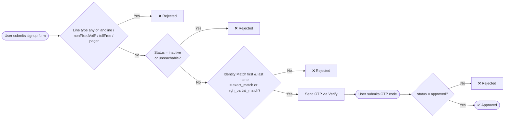

# lookup-bundle

A demo app showing how to use Twilio Lookup and Verify to gate user onboarding with phone intelligence checks.



## Setup

1. Clone the repo and install dependencies:
   ```bash
   npm install
   ```

2. Copy `.env.example` to `.env` and fill in your credentials:
   ```bash
   cp .env.example .env
   ```

3. Run the app:
   ```bash
   node index.js
   ```

Open [http://localhost:3000](http://localhost:3000).

## Required environment variables

| Variable | Description |
|---|---|
| `TWILIO_ACCOUNT_SID` | Your Twilio Account SID |
| `TWILIO_AUTH_TOKEN` | Your Twilio Auth Token |
| `VERIFY_SERVICE_SID` | A Twilio Verify Service SID (`VA...`) |
