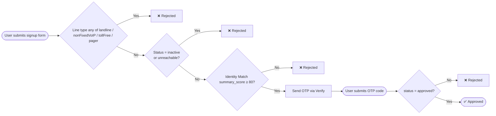

```mermaid
flowchart LR
    A([User submits signup form]) --> D{Line type any of landline / nonFixedVoIP / tollFree / pager}
    D -- Yes --> R3[❌ Rejected]
    D -- No --> F{Status = inactive<br/>or unreachable?}
    F -- Yes --> R5[❌ Rejected]
    F -- No --> I{Identity Match summary_score ≥ 80?}
    I -- No --> R8[❌ Rejected]

    I -- Yes --> J[Send OTP via Verify]
    J --> K([User submits OTP code])
    K --> N{status = approved?}
    N -- No --> R12[❌ Rejected]
    N -- Yes --> Z([✅ Approved])
```